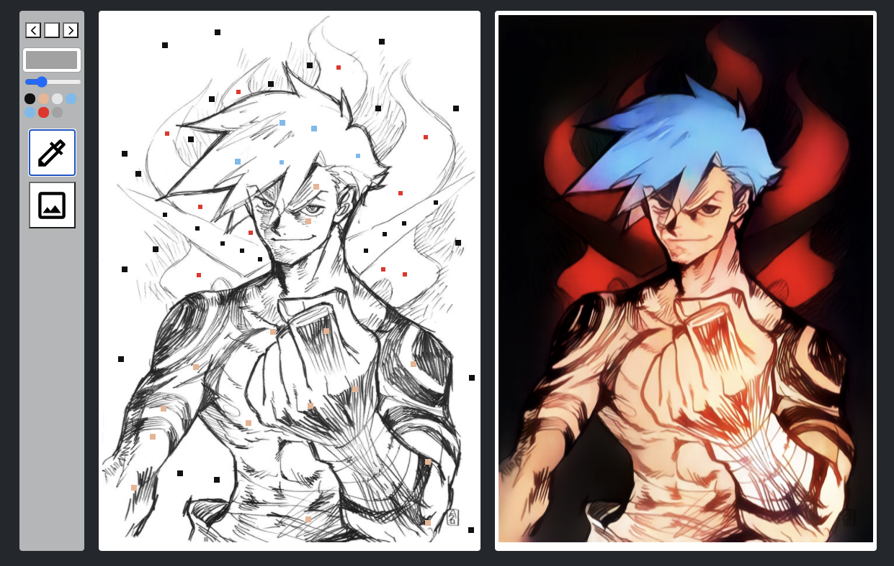
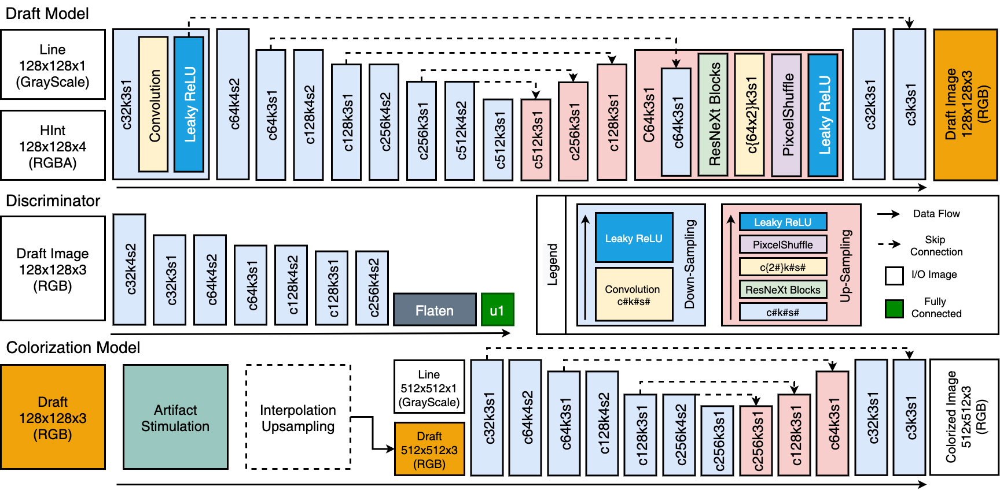
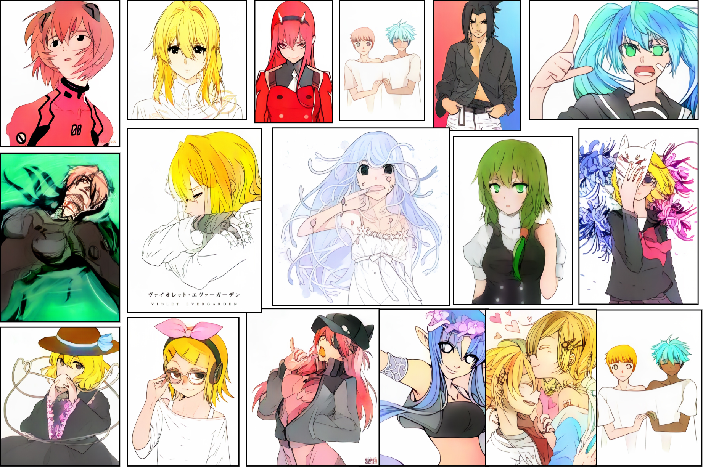
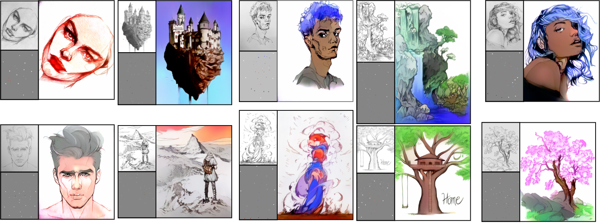

# Coming Soon

# SketchColorization

# Model Structure

# Samples

# Requirements

- TODO

# Dataset

- We crawled over 1,000,000 illustrations from [shuushuu-image-board](https://e-shuushuu.net/) and used them for learning.

- We have filtered out noise such as extreme aspect ratio, black and white image, low / high key images and etc.

# Training

- TODO

# Pre trained model

- TODO
